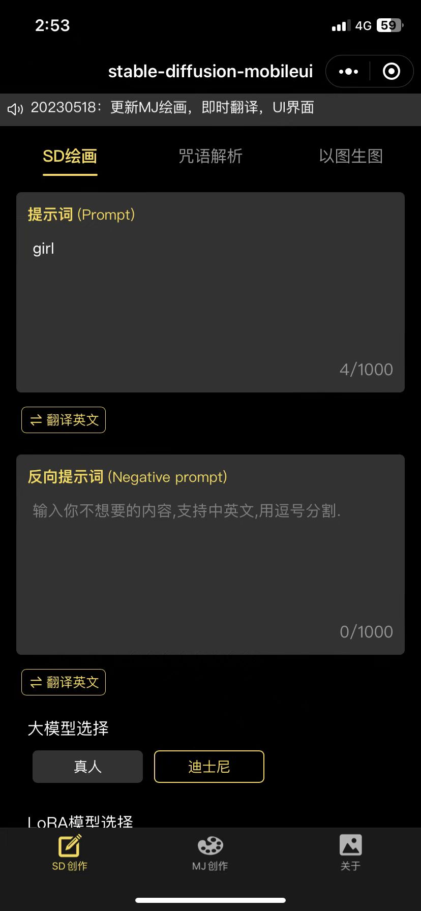
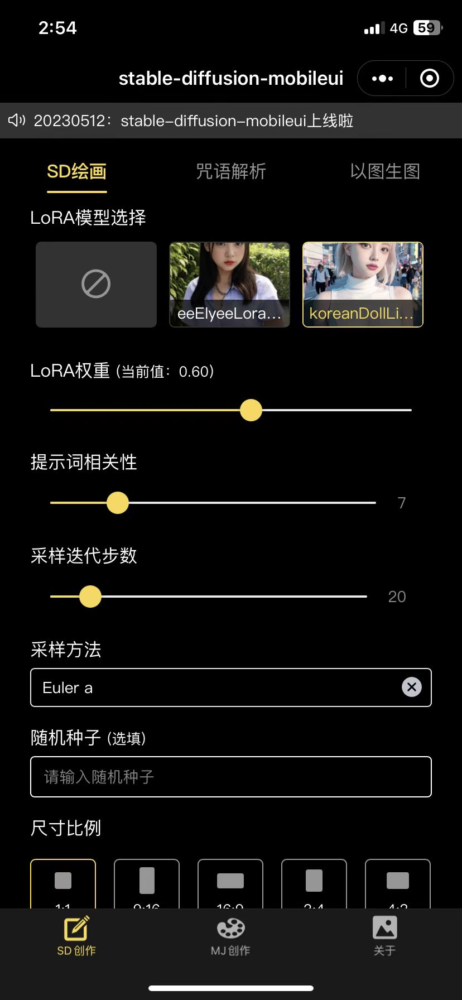
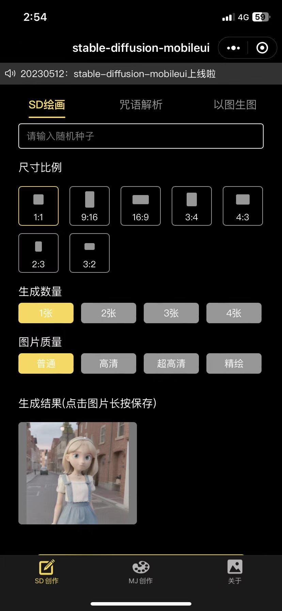
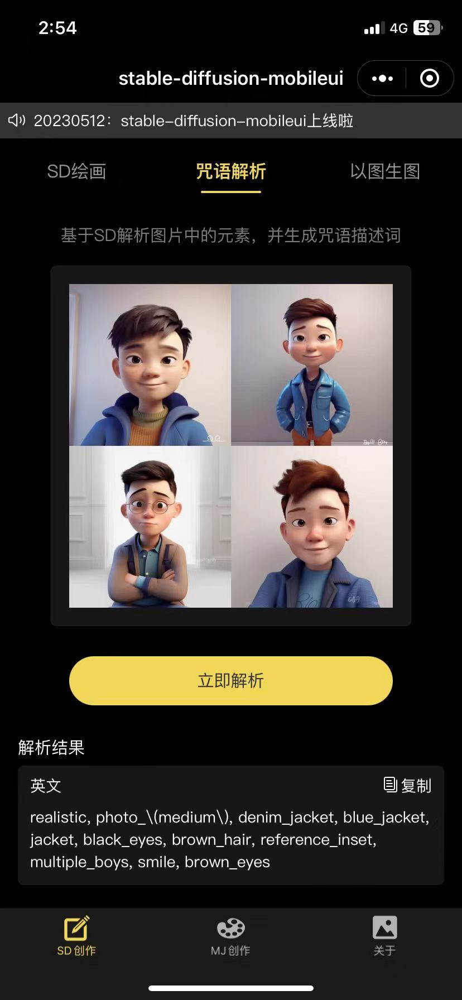
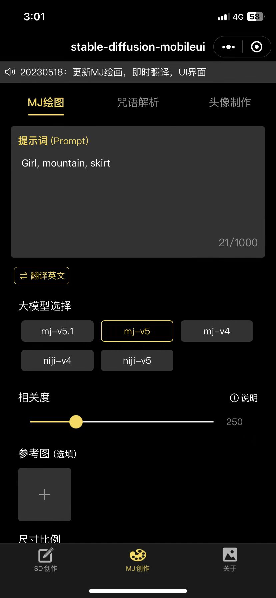
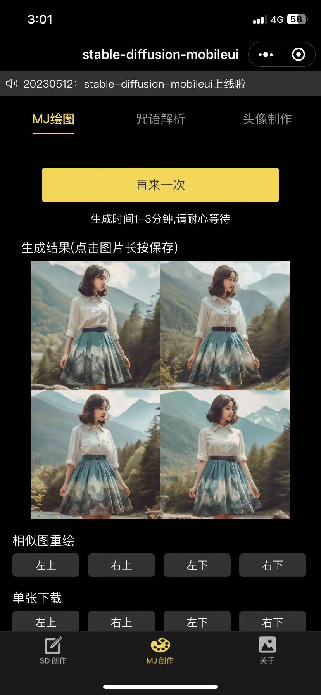
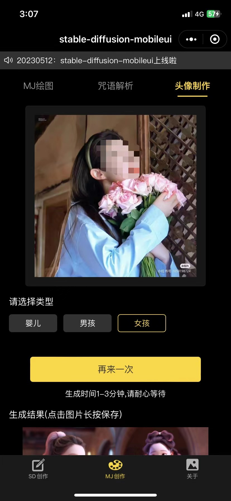
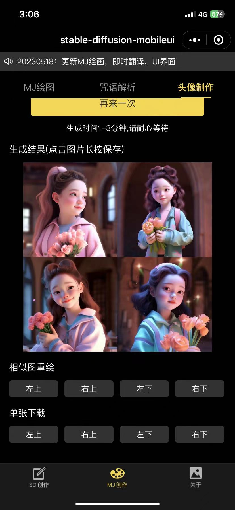
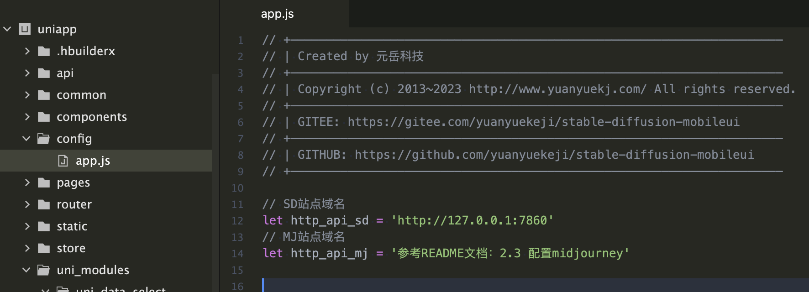

# stable-diffusion-mobileui

## 1. 项目介绍

方便随时随地的使用stable diffusion和Midjourney。基于一键包搭建的stable-diffusion，配合本项目可以搭建适配移动端的界面UI，可以生成H5和微信小程序。

### 1.1效果展示

### 1.2主要功能：

|入口|功能模块|功能点|说明|
|:----|:----|:----|:----|
|SD创作|SD绘画|提示词|可填中英文词，自带翻译|
|    |    |反向提示词|可填中英文词，自带翻译|
|    |    |大模型选择|选择 SD大模型|
|    |    |LoRA模型选择|可选，选择需设置权重|
|    |    |提示词相关性|默认7，可选1-30|
|    |    |采样迭代步数|默认20，可选1-150|
|    |    |采样方法|    |
|    |    |尺寸比例|多比例选择|
|    |    |生成数量|默认1张，可选1-4张|
|    |    |图片质量|普通、高清、精绘|
|    |    |生成结果|点击后，长按保存到设备|
|    |    |随机数种子|默认-1|
|    |咒语解析|选择图片|上传图片|
|    |    |解析结果|查看和复制英文结果|
|    |以图生图|敬请期待|    |
|MJ创作|MJ绘画|提示词|可填写中英文，自带翻译|
|    |    |模型选择|选择mj的模型|
|    |    |相关度选择|默认250，可选0-1000|
|    |    |垫图权重选择|默认1，可选0.5-2|
|    |    |垫图选择|可选|
|    |    |尺寸比例|默认1:1，多比例选择|
|    |    |UV转换|可重绘和单独下载|
|    |咒语解析|选择图片|上传图片|
|    |    |解析结果|查看和复制英文结果|
|    |头像制作|选择图片|上传垫图|
|    |    |选择类型|婴儿，男孩，女孩|
|    |    |UV转换|可重绘和单独下载|
|关于|关于我们|项目说明|    |
|顶部|通知栏|滚动消息通知|    |

### 1.3即将发布：

1.SD图生图

2.MJ合成图

### 不断更新优化，欢迎Star。如需定制，欢迎联系

## 2. 搭建步骤

### 2.1 安装一键端

2.1.1一键端使用的是秋葉aaaki的整合包，直接下载根据说明安装即可

秋叶大佬原百度网盘链接https://pan.baidu.com/s/1_ibEk2OpKHxmEg4AnFOpSA 提取码b145

注意：若链接失效，加群获取最新，群号见最下方

2.1.2 安装完成后在启动界面找到左侧的【高级选项】--【网络设置】--勾选【开放远程连接】，勾选【启用API】，往下拉，找到【CORS授权管理】--新增一条记录为*

2.1.3 回到左侧，点击左上角第一个【一键启动】，回到启动界面，点击右下角的【一键启动】

### 2.2 安装H5端
2.2.1 下载本仓库下的`uniapp`文件夹;  

2.2.2 使用`Hbuilder`打开项目,在`uniapp/config/app.js`中的`http_api_sd`处填写您的域名;  

此处的域名是指你启动的【SD一键包】的地址，一般默认为http://127.0.0.1:7860
 
  

2.2.3 `Hbuilder`工具栏->运行->运行到浏览器->Chrome;  

2.2.4 如需发布到公网，则依次点击发布即可`Hbuilder`工具栏->发行->网站-PCweb或手机H5;将打包后的文件上传到服务器即可。此时要注意，必须将本地SD内网穿透到外网，否则无法访问。 

### 2.3 配置midjourney【可选】
如果有midjourney账号，需要调用MJ绘画功能的话，请加QQ群（群号见最下方），获取midjourney的配置文档

### 2.4 安装微信小程序
2.4.1在以上配置好api地址后，仅需配置微信小程序appid即可，位置在：源码根目录manifest.json,点击后，右侧找到微信小程序配置，配置顶部的微信小程序APPID即可。

2.4.2 `Hbuilder`工具栏->运行->运行到小程序模拟器->微信开发者工具; 

## 3. 其他资料
3.1新增LoRA模型

LoRA模型下载地址：https://civitai.com/

放置位置：SD根目录的 \models\Lora\目录下

3.2新增大模型

大模型下载地址：https://huggingface.co/models

放置位置：SD根目录的 \models\Stable-diffusion\目录下

3.3内网穿透方式FRP，NPS，zerotier

FRP官网：https://github.com/fatedier/frp

NPS官网：https://ehang-io.github.io/nps/#/

zerotier官网：https://www.zerotier.com/

## 4. 常见问题

4.1跨域如何解决

见上方搭建步骤2.1.2

4.2LoRA无图片如何解决

需要自行新增图片，假设LoAR名称为AAA.safetensors，在其同级目录下放置一张你喜欢的图片，重命名为AAA.png即可

4.3如果需要从外网访问到，需根据3.3的方式配置内网穿透并且重新设置H5或小程序的域名地址

4.4我发布到公网服务器或者小程序了，为什么接口访问不到呢？

请查看SD是否内网穿透映射到了外网，MJ接口是否完整搭建。是否将域名都配置了HTTPS

4.5我新增了LoRA模型为什么没有在小程序端或者H5端显示呢？

请重启SD一键端

## 5. 更新日志

20230526：新增midjourney文生图和咒语解析，完善midjourney图生图，支持选择模型，相关度等，修复SD问题，更新MJ接入文档，

20230520：新增midjourney图生图UV转换，MJ接入文档更新

20230518：新增midjourney以图生图，更新新的UI界面，新增即时翻译

20230512：初版发布
## 6. 联系我们  
- QQ讨论群:341220974

 

